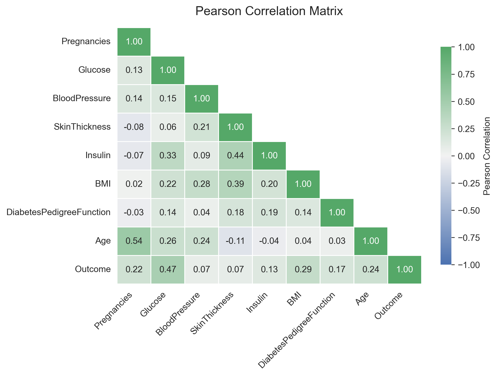
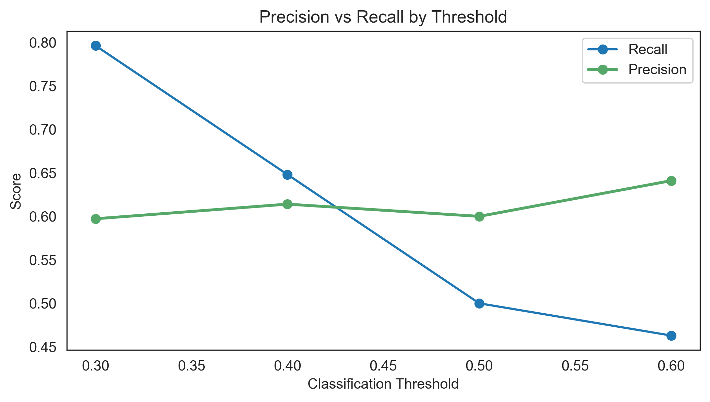
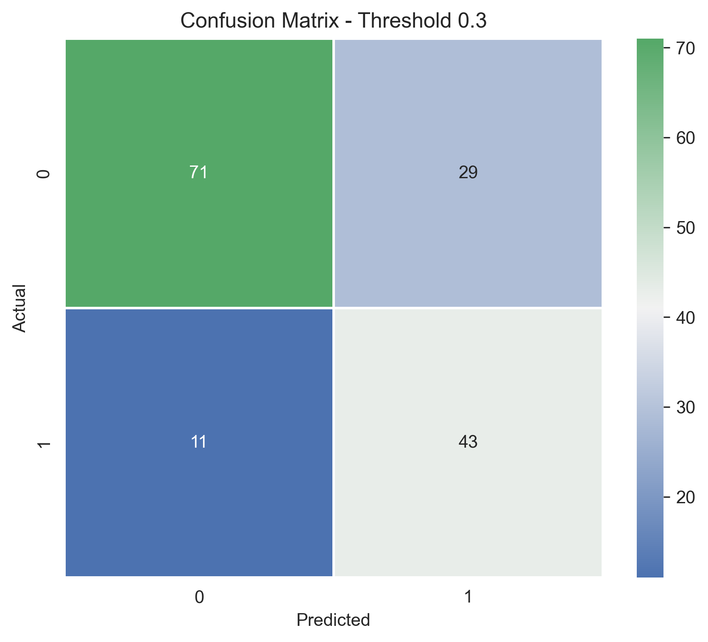
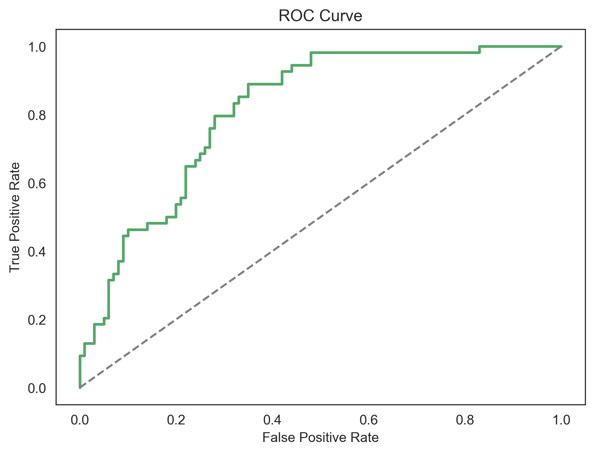

# Diabetes Prediction \| Logistic Regression

An end-to-end binary classification workflow covering data analysis,
Logistic Regression modeling, model evaluation, hyperparameter tuning,
and threshold optimization.

------------------------------------------------------------------------

## Project Overview

This project develops a classification workflow to predict diabetes
outcomes using Logistic Regression.

The focus is not only on model performance, but also on understanding
the dataset, validating data quality, exploring relationships between
features, preparing the data correctly, evaluating the model, and
interpreting the results.

------------------------------------------------------------------------

## Key Highlights

-   Interpretable Logistic Regression baseline
-   Evaluation using Accuracy, Precision, Recall, F1 Score, and ROC-AUC
-   Hyperparameter tuning with GridSearchCV
-   Classification threshold optimization
-   Focus on reproducible and explainable ML workflow

------------------------------------------------------------------------

## Problem Statement

Diabetes prediction is a binary classification problem where the
objective is to identify whether a patient is likely to have diabetes
based on medical-related features.

In healthcare-related machine learning tasks, evaluating a model
requires more than accuracy alone. Understanding false positives, false
negatives, recall, and precision is essential when making prediction
decisions.

------------------------------------------------------------------------

## Dataset

The dataset contains medical measurements and demographic information
used to predict diabetes outcomes.

### Target Variable

**Outcome**

-   0 → No Diabetes
-   1 → Diabetes

------------------------------------------------------------------------

# Project Workflow

## 1. Data Understanding & Validation

Performed:

-   Dataset structure review
-   Feature inspection
-   Data quality checks
-   Missing value analysis
-   Duplicate review
-   Initial statistical analysis

------------------------------------------------------------------------

## 2. Exploratory Data Analysis

The following analyses were performed:

-   Target distribution analysis
-   Numerical feature distributions
-   Feature relationship analysis
-   Pearson correlation analysis
-   Outlier review

------------------------------------------------------------------------

## 3. Data Preparation

Preparation steps included:

-   Separating features and target
-   Train/test split
-   Feature scaling
-   Preparing data for Logistic Regression

------------------------------------------------------------------------

# Modeling

## Baseline Logistic Regression

Logistic Regression was selected as an interpretable baseline
classification model.

Reasons for selecting this model:

-   Provides probability-based predictions
-   Allows feature coefficient interpretation
-   Creates a clear and explainable baseline

------------------------------------------------------------------------

# Model Evaluation

Metrics used:

-   Accuracy
-   Precision
-   Recall
-   F1 Score
-   ROC-AUC
-   Confusion Matrix

For medical classification problems, recall is especially important
because it reflects the model's ability to identify positive cases.

------------------------------------------------------------------------

# Model Improvement

## Hyperparameter Tuning with GridSearchCV

GridSearchCV was applied to evaluate different Logistic Regression
configurations.

Parameters explored:

-   Regularization strength (`C`)
-   Penalty type
-   Solver

The tuned model was compared with the baseline model.

### Result

The GridSearchCV model did not outperform the baseline model.

This demonstrates that increasing model complexity or tuning parameters
does not always guarantee better performance.

------------------------------------------------------------------------

## Threshold Optimization

Logistic Regression produces probabilities before assigning final class
labels.

Different classification thresholds were evaluated:

-   0.3
-   0.4
-   0.5
-   0.6

### Selected Decision Strategy

A threshold of **0.3** improved the model's ability to identify positive
diabetes cases.

Compared with the default threshold:

-   Recall improved significantly
-   F1 Score improved
-   More positive cases were detected

This improvement came from adjusting the decision strategy rather than
changing the algorithm.

------------------------------------------------------------------------

# Model Insights

## Correlation Analysis

## Threshold Optimization

## Final Confusion Matrix

## ROC Curve

------------------------------------------------------------------------

# Future Improvements

Possible future improvements:

-   Compare additional algorithms:
    -   Random Forest
    -   Gradient Boosting
    -   XGBoost
    -   Support Vector Machines
-   Advanced feature engineering
-   More extensive hyperparameter optimization
-   Ensemble modeling

------------------------------------------------------------------------

# Technologies & Libraries

-   Python
-   Pandas
-   NumPy
-   Matplotlib
-   Seaborn
-   Scikit-learn

------------------------------------------------------------------------

# What I Learned

The main lesson from this project was that improving a machine learning
model is not only about achieving a higher metric value.

Building a Logistic Regression baseline provided an interpretable
starting point and helped evaluate how different metrics reflect model
performance. This project showed that in medical classification
problems, recall, precision, and the cost of prediction errors are as
important as accuracy.

GridSearchCV was useful for testing different model configurations, but
the results showed that more complex tuning does not always lead to
better performance. The biggest improvement came from optimizing the
classification threshold and aligning the decision strategy with the
goal of identifying positive cases.

This project reinforced the importance of building reproducible
workflows, validating improvements with evidence, and making every
modeling decision clear and explainable.
